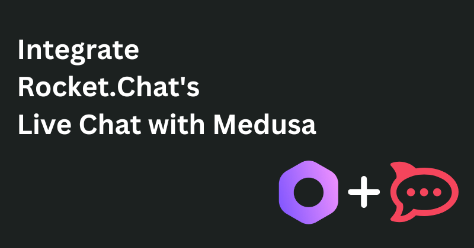
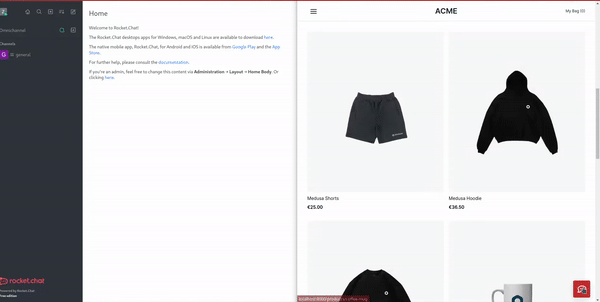

## Integrate Rocket.Chat's Live Chat with Medusa



### Demo Link

If you have hosted your submission for demo purposes, please include a link to the demo right after the cover image.

If you also publish your submission on NPM (if applicable), include a link to it here.

## About

This is a demo of integrating Rocket.Chat into Medusa to enable live chat features in your store.

### Participants

<details>
    <summary>Kayode Oluwasegun</summary>
    <p>Github: <a href="https://github.com/zt4ff">https://github.com/zt4ff<a/></p>
    <p>Discord ID: Kayode Segun#9230</p>
</details>

### Description

This submission is a demo of integrating the live chat features of Rocket.Chat into Medusa to enable a more efficient customer support method.
The storefront is created using the [Next.js starter](https://docs.medusajs.com/starters/nextjs-medusa-starter/) template.

### Preview




## Set up Project

This section should cover how to set up and run the project locally. It’s intended to help the Medusa team properly review your submission, as well as help the community to benefit from your submission.

### Prerequisites

If running your submission requires any prerequisites, make sure to list them in this section.

Examples of Prerequisites:
- Create an account in [Rocket.Chat](https://www.rocket.chat/) using a work email.

### Install Project

In this section, cover step by step how to run your submission, with each step having a code block example of the command if applicable.

For example:

1. Clone the repository:

```bash
git clone https://github.com/medusajs/hackathon-oct2022-guidelines.git
```

1. Change directory and install dependencies:

```bash
cd directory
npm install
```

## Resources

In this section, include links to Medusa’s GitHub repository and documentation. If you think there are any specific documentation pages that can be helpful to understand your submission more, include these specific pages.

For example:

- [Medusa’s GitHub repository](https://github.com/medusajs/medusa)
- [How to Create Services](https://docs.medusajs.com/advanced/backend/services/create-service)

If you also used any other framework, service, or tool, you can include some links to helpful resources related to those tools.
