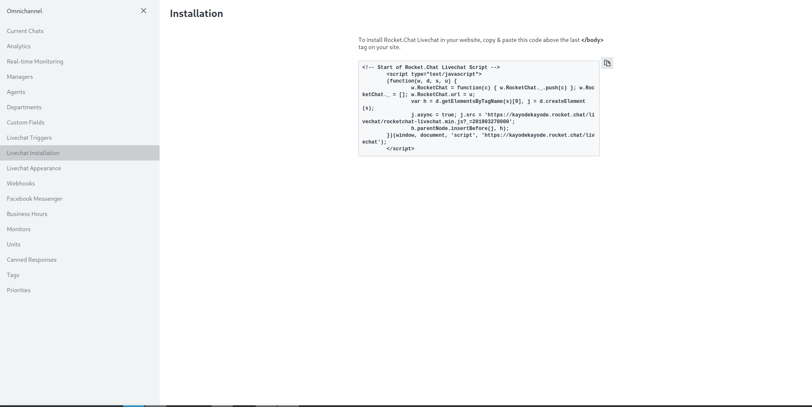

## Integrate Rocket.Chat's Live Chat with Medusa


## About

This is a demo of integrating Rocket.Chat into Medusa to enable live chat features in your store.

### Participants

<details>
    <summary>Kayode Oluwasegun</summary>
    <p>Github: <a href="https://github.com/zt4ff">https://github.com/zt4ff<a/></p>
    <p>Discord ID: Kayode Segun#9230</p>
</details>

### Description

This submission is a demo of integrating the live chat features of Rocket.Chat into Medusa to enable a more efficient customer support method.
The storefront is created using the [Next.js starter](https://docs.medusajs.com/starters/nextjs-medusa-starter/) template.

### Preview


## Set up Project

To setup this project on your local machine you need to have the prerequisites listed below and then follow the instructions also listed.

### Prerequisites

To run this store on your local machine, you need to have these:

- Nodejs installed locally in your machine: Instructions [here](https://nodejs.org/en/download/)
- Create an account in [Rocket.Chat](https://www.rocket.chat/) using a work email.

### Install Project

Follow the steps in order to install the project in your local machine:

1. Clone the repository:

```bash
git clone https://github.com/zt4ff/integrate-medusa-with-rocketchat.git
```

2. Change directory into `storefront` and `backend` then install the dependencies (Note: if you are installing most of the required dependencies for the first time, it might take a while to install depending on your network and processor speed.):

```bash
cd storefront
npm install
cd ../backend
npm install
```

3. You need to copy some code from your Rocket.Chat account by following these steps:

   - create an agent in Rocket.Chat via clicking your avatar icon -> Omnichannel -> Agents.
   - Set your status as an agent to "Available" to use the live-chat feature.
   - Clicking on Administration -> Settings -> General, disable the "Restrict access inside any iframe" option.
   - Clicking on Administration -> Settings -> Omnichannel, click the Livechat dropdown and update the "Email Address to Send Offline Messages" and "Offline Success Message" prompt.
   - Finally, copy the JavaScript immediately invoked function expression that is given to you when you click on the your avatar icon -> Ommnichannel -> Livechat Installation and paste it into `/storefront/src/pages/index.tsx` within the `Script` component enclosed by an a backtick and a curly braces. For instance:

     
     ```tsx
     // ...
     return (<>
        <Script>
            {`
                (function(x, y, z) {
                    //...
                })();
            `}
        </Script>
     <>)

     ```

4. In your terminal, still in the `/backend` directory, start both the storefront and backend server by running these commands:

```bash
npm start
cd ../storefront
npm run dev
```

5. You can now access your store at [http://localhost:8000](http://localhost:8000)

## Resources

- [Medusa’s GitHub repository](https://github.com/medusajs/medusa)
- [Using external scripts in your Next project](https://nextjs.org/docs/api-reference/next/script)
- [Rocket.Chat's Omnichannel Documentation](https://docs.rocket.chat/guides/omnichannel)
